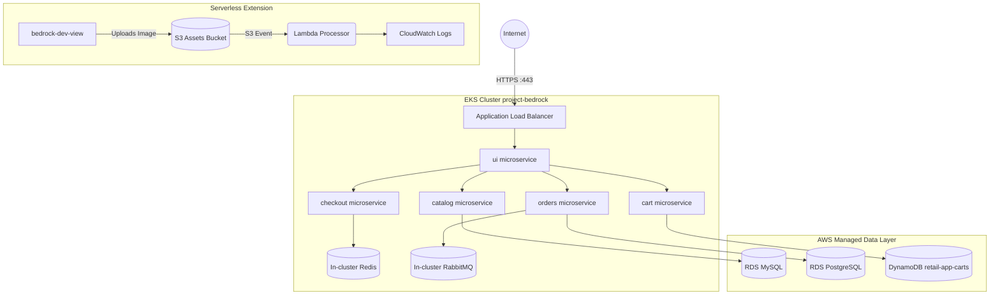

# Project Bedrock - Retail E-Commerce Microservices

This repository contains the Infrastructure as Code (Terraform) and Kubernetes Deployment files for the **Project Bedrock** retail store application.

## Prerequisites
- AWS CLI configured
- Terraform >= 1.5.0
- kubectl
- helm

## Infrastructure Deployment

1. Make sure you have created your S3 Bucket for Terraform State as defined in `providers.tf`.
2. Initialize and apply Terraform:
   ```bash
   terraform init
   terraform apply -auto-approve
   ```

## Application Deployment (Helm-Based)
As per the assignment requirements (Section 5.1), the application deployment has been refactored to use the upstream `retail-store-sample-app` Helm chart combined with a custom overrides file. 

The application is deployable with a single bash script that handles injecting secure database credentials and applying the Helm chart.

```bash
# Deploys the entire microservices stack
./kubernetes/deploy.sh
```

Under the hood, this script runs the equivalent of:
```bash
helm upgrade --install retail-store ../retail-store-sample-app/src/app/chart \
  --namespace retail-app \
  -f kubernetes/values-injected.yaml
```

## Advanced Networking & TLS (Ingress)
As per the assignment requirements (Section 5.2):
- **Custom Domain/TLS**: A self-signed TLS certificate is generated automatically via Terraform and imported into AWS Certificate Manager (ACM).
- **HTTPS Termination**: The Application Load Balancer (ALB) terminates HTTPS traffic on port 443 using this ACM certificate before forwarding traffic securely to the `ui` microservice.

## Architecture Diagram



## Grading & Deployment Guide

### Application URL
You can securely access the running retail store here:
**URL:** [https://k8s-retailap-ui-6039ab69e6-1519555346.us-east-1.elb.amazonaws.com](https://k8s-retailap-ui-6039ab69e6-1519555346.us-east-1.elb.amazonaws.com)

### CI/CD Pipeline
The CI/CD pipeline is fully automated via GitHub Actions (`.github/workflows/terraform.yml`).
- **To trigger validation:** Open a Pull Request against the `main` branch.
- **To trigger deployment:** Merge code into the `main` branch.

### Grading Credentials
The IAM credentials for the `bedrock-dev-view` user (Console Password, Access Key, and Secret Key) have been omitted from this public repository for security reasons. 

They are securely provided within the **Google Document** submission, as requested by the assignment guidelines.

### Grading Data
The JSON output file containing all infrastructure metadata (`grading.json`) has been generated and is committed to the root of the repository.
